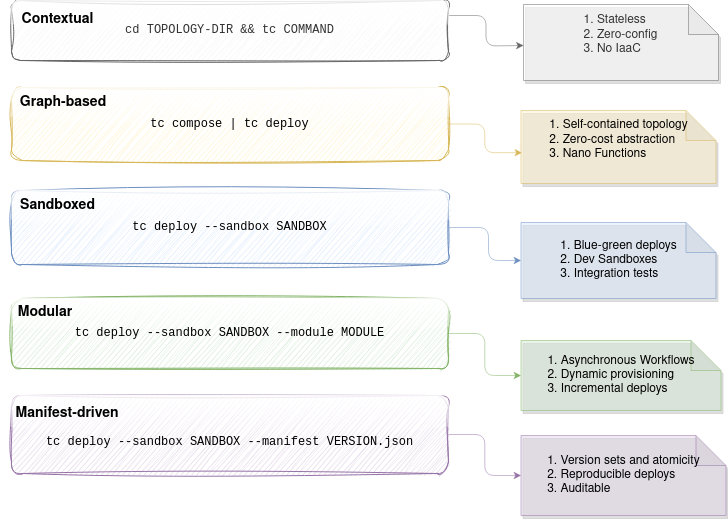

Cloud Functors are toplogies `composed` of nano functions, states, events and routes. These nano functions (Lambdas) capture enough business logic and offload IO and state management to an orchestrator (typically Stepfns).

`tc` is a cli tool, written in Rust, that implements the `cloud functors` pattern and enables sophisticated dev, release and debugging workflows.

## Features

### Commands overview

Usage: tc <COMMAND>

Commands:
  bootstrap  Bootstrap IAM roles, extensions etc
  build      Build layers, extensions and pack function code
  compile    Compile a Topology
  create     Create a sandboxed topology
  delete     Delete a sandboxed topology
  emulate    Emulate Runtime environments
  invoke     Invoke a topology synchronously or asynchronously
  list       List created entities
  publish    Pulish layers, slabs and assets
  resolve    Resolve a topology from functions, events, states description
  scaffold   Scaffold roles and infra vars
  test       Run unit tests for functions in the topology dir
  update     Update components
  upgrade    upgrade tc version
  version    display current tc version
